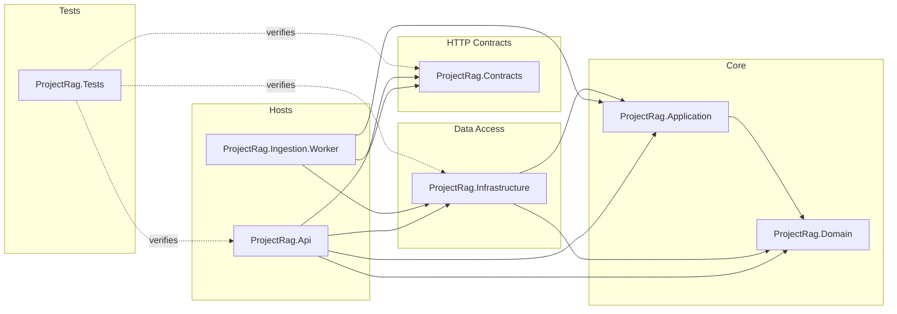
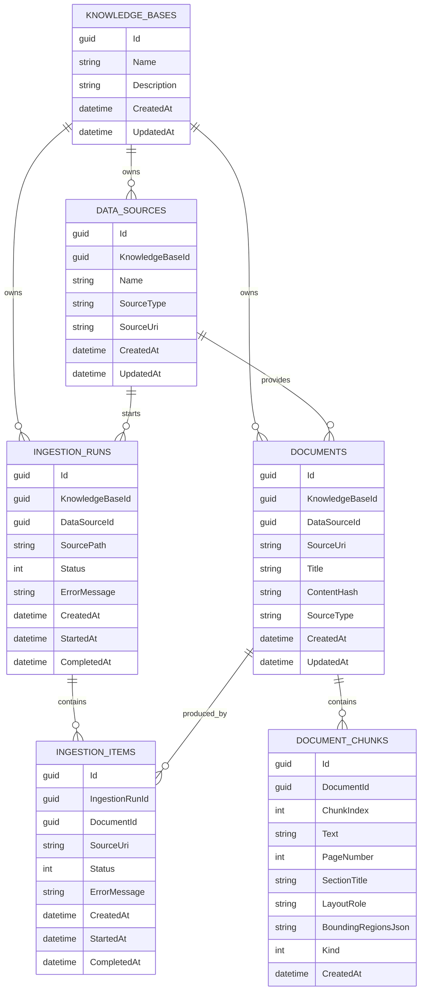
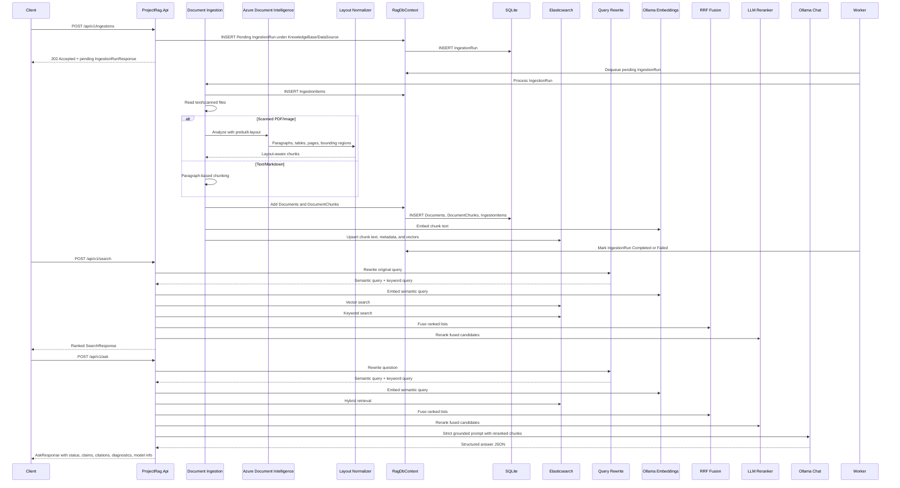

# Architecture

ProjectRag is a layered .NET RAG service. The architecture is intentionally conservative: establish clear boundaries, persistence, API contracts, testability, scanned document extraction, persistent search indexing, hybrid retrieval, query rewriting, RRF fusion, semantic reranking, grounded answer generation, evaluation, and observability. This repository stops at that learning checkpoint; agentic orchestration and production hardening are intended for a future fork.

## Layers

```text
ProjectRag.Api
  Minimal API endpoints
  Composition root
  OpenAPI setup

ProjectRag.Contracts
  Request and response DTOs
  HTTP boundary models

ProjectRag.Domain
  Persistent domain entities
  Domain enums

ProjectRag.Infrastructure
  EF Core DbContext
  SQLite provider registration
  Elasticsearch client and search index services
  Entity configurations
  Migrations
  Text ingestion
  Azure AI Document Intelligence extraction
  Layout-aware chunk normalization
  Ollama AI client registration
  LLM query rewriting
  Reciprocal Rank Fusion
  Local LLM reranking
  Grounded answer generation
  Hybrid keyword/vector retrieval

ProjectRag.Application
  Application abstractions, cross-layer models, and shared telemetry source

ProjectRag.Ingestion.Worker
  Background ingestion processor

ProjectRag.Tests
  Integration and unit tests
```

## Dependency Direction

The current dependency shape is:

```text
Api -> Contracts
Api -> Infrastructure
Infrastructure -> Domain
Infrastructure -> Application
Application -> Domain
Tests -> Api, Contracts, Infrastructure
```

The domain project should stay independent. It should not reference EF Core, ASP.NET Core, Infrastructure, or API.

## Type Visibility

Keep the public surface area small:

- Infrastructure concrete services/configurations/options: `internal`.
- Infrastructure DI entry point and `RagDbContext`: `public`.
- Application abstractions/models: `public`.
- Domain entities/enums: `public`.
- Contract request/response DTOs: `public`.
- API endpoint mapping classes: `internal`.
- `Program`: `public partial` so integration tests can use `WebApplicationFactory<Program>`.



## Persistence Model

The persistence layer stores EF Core metadata plus external search indexes:

- `Document`: one original source document.
- `DocumentChunk`: one searchable text chunk belonging to a document.
- `KnowledgeBase`: logical grouping boundary for sources, documents, and ingestion runs.
- `DataSource`: provider-neutral provenance for a configured or discovered source.
- `IngestionRun`: durable status record for one ingestion request.
- `IngestionItem`: per-file ingestion status record that can link to the produced document.
- `projectrag-chunks`: Elasticsearch index keyed by chunk id.

Current EF Core tables:

```text
Documents
DocumentChunks
KnowledgeBases
DataSources
IngestionRuns
IngestionItems
```

`DocumentChunk` has a required relationship to `Document` and cascades on document deletion. `KnowledgeBase` owns data sources, documents, and ingestion runs. `DataSource` provides provenance for documents and ingestion runs. `IngestionRun` owns its ingestion items. Successful ingestion items link to the document they produced, reused, or reindexed; failed items may have no document link. Elasticsearch stores chunk text, metadata, and embeddings outside EF Core migrations.



## EF Core Configuration

EF mapping is configured with Fluent API classes in Infrastructure:

```text
ProjectRag.Infrastructure/Configurations/Persistence
```

`RagDbContext` applies these configurations through:

```csharp
modelBuilder.ApplyConfigurationsFromAssembly(typeof(RagDbContext).Assembly);
```

This keeps persistence mapping out of domain entities.

## RAG Flow

Implemented behavior:

- `POST /api/v1/ingestions` queues `.md`, `.txt`, PDF, and common image files from a local path as a durable ingestion run.
- `GET /api/v1/ingestions/{id}` returns a persisted ingestion run with item-level status.
- `GET /api/v1/documents` reads documents from SQLite.
- `POST /api/v1/search` rewrites the query, runs Elasticsearch keyword search and Elasticsearch vector search, fuses candidates with RRF, reranks the fused candidates with a local LLM, and returns ranked hits with retrieval diagnostics.
- `POST /api/v1/ask` rewrites the question, retrieves top chunks, builds a strict grounded prompt, calls the chat model, and returns answer status, structured claims, citations, retrieval diagnostics, and model info.

Chunk embeddings are generated once during ingestion and stored in Elasticsearch with chunk text and metadata. Search rewrites the original user query into a semantic query for vector retrieval and a keyword query for full-text retrieval. It embeds only the semantic query, runs keyword and vector retrieval independently, deduplicates candidates by chunk id, fuses the ranked lists with Reciprocal Rank Fusion, and reranks the fused candidate set. `RrfScore` is the fusion score, `RerankScore` is the second-stage relevance score, and `VectorScore` plus `KeywordScore` are raw provider scores for diagnostics.

Answer generation uses the reranked chunks as context. The answer model must return structured JSON with `answerStatus`, `answer`, and cited `claims`. Claim source indexes are mapped back to citation chunk ids at the application layer. If there are no retrieved chunks, invalid answer JSON, or answered claims without citations, the answer service returns `insufficientContext`.

## Retrieval Configuration

Retrieval is currently config-backed but intentionally narrow. The supported strategy is hybrid Elasticsearch keyword plus vector search, application-level RRF fusion, and optional LLM reranking. Query rewriting remains enabled as part of the deterministic RAG pipeline.

Current supported `Retrieval` values:

- `RetrievalMode`: `hybrid`
- `FusionMode`: `application_rrf`
- `EnableReranking`: `true` or `false`
- `RerankerMode`: `llm` when reranking is enabled, `none` when reranking is disabled

Unsupported strategy names fail startup validation. Elasticsearch-native RRF is available as an opt-in Infrastructure adapter through `FusionMode: elastic_native_rrf`; application-level RRF remains the default. Future ELSER, semantic retrieval, and provider-native reranking should expand these allowed values only when matching runtime behavior exists.

## Microsoft.Extensions.AI Alignment

Microsoft.Extensions.AI is used as an Infrastructure tool, not as the architecture boundary. ProjectRag keeps provider-neutral Application ports for RAG-specific behavior and uses Microsoft abstractions where they reduce provider glue.

| Boundary | Current implementation | Phase 2 decision | Reason |
| --- | --- | --- | --- |
| Chat model access | `IChatClient` registered in Infrastructure with provider-specific factories | Keep MEAI in Infrastructure | Standard model access without coupling Domain or Application to a provider |
| Embedding generation | `IEmbeddingGenerator<string, Embedding<float>>` registered in Infrastructure with provider-specific factories | Keep MEAI in Infrastructure | Standard embedding access and provider portability |
| Query rewriting | `IQueryRewriteService` custom Application port | Keep custom port | RAG-specific behavior and diagnostics |
| Reranking | `IRerankerService` custom Application port using `IChatClient` internally | Keep custom port | RAG-specific scoring behavior; provider details stay hidden |
| Answer generation | `IRagAnswerService` custom Application port using `IChatClient` internally | Keep custom port | Grounding, citations, claims, fallback parsing, and diagnostics are app behavior |
| Search indexing | `ISearchIndexService` custom Application port backed by Elasticsearch | Keep custom port | Indexing includes ProjectRag chunk metadata and Elasticsearch-specific behavior |
| Retrieval search | `IRetrievalSearchService` custom Application port backed by hybrid Elasticsearch retrieval | Keep custom port | Preserve deterministic retrieval and Elasticsearch diagnostics |
| Vector store abstraction | Elasticsearch record and native client remain primary | Evaluate only | Avoid hiding Elasticsearch-native retrieval features too early |
| Chunking | `ITextChunker` custom Application port | Defer package adoption | Current paragraph/layout behavior is the baseline; future chunkers stay behind the same port |
| Document extraction | `IDocumentExtractor` custom Application port backed by Azure Document Intelligence | Keep custom port | Extraction provider stays Infrastructure-only |
| Evaluation | deterministic test/eval harness | Defer MEAI eval packages | Keep stable regression baseline; add quality evals later |
| Telemetry | custom RAG spans plus MEAI OpenTelemetry wrappers | Keep, with sensitive data disabled by default | Counts, statuses, and model tags are useful; raw prompts and document text should not be captured by default |

Phase 2 does not replace Application ports with Microsoft abstractions by default. A Microsoft abstraction can cross into Application only if it is more stable and less provider-coupled than the custom ProjectRag model. Current decision: keep RAG-specific ports custom.

Runtime option names are provider-neutral: `ChatRuntimeOptions` binds the `Chat` section and `EmbeddingRuntimeOptions` binds the `Embedding` section. The selected provider is interpreted only by Infrastructure.

Provider-specific runtime creation is isolated in Infrastructure factories. Current supported local providers are Ollama, LM Studio, and Foundry Local. LM Studio and Foundry Local use the OpenAI-compatible local provider path. Azure OpenAI is a known provider name, but remains unsupported until Azure auth, endpoint shape, deployment names, and secret handling are designed. Future providers should be added behind those factories or adapters without changing Domain, Application ports, or API contracts.

Current local provider configuration shape:

```json
"Chat": {
  "Provider": "LMStudio",
  "Endpoint": "http://localhost:1234/v1",
  "Model": "local-model",
  "ApiKey": "local-dev-placeholder",
  "TimeoutSeconds": 300
}
```

```json
"Embedding": {
  "Provider": "LMStudio",
  "Endpoint": "http://localhost:1234/v1",
  "Model": "local-embedding-model",
  "ApiKey": "local-dev-placeholder",
  "TimeoutSeconds": 300
}
```

Structured model outputs currently use prompt-only JSON plus Infrastructure parsers that validate and fall back deterministically. MEAI `ChatOptions.ResponseFormat` and provider-native structured output should be evaluated later behind Infrastructure without changing Application ports or API contracts.

Switching structured output strategy needs evidence from tests or evals that it improves reliability without losing provider portability. Until then, prompts define the requested JSON shape and parsers own validation, fallback behavior, and telemetry fallback flags.

MEAI `ChatOptions` are not part of the Application contract today. Runtime timeout is controlled by provider-neutral runtime options and the underlying `HttpClient`. Temperature, max tokens, response format, and provider-specific structured output settings should stay in Infrastructure adapters when they are introduced.

VectorData is not the active retrieval boundary. `ElasticDocumentChunkRecord` remains an Elasticsearch record with ProjectRag metadata, embedding model metadata, and native index mapping. VectorData should be evaluated as an adapter option only if it preserves metadata filters, citations, diagnostics, and access to Elasticsearch-native retrieval features.

Text and markdown files use configurable paragraph-based fixed-size chunking. The active supported strategy is `paragraph`; unsupported strategy names fail startup validation. Scanned documents use Azure AI Document Intelligence `prebuilt-layout`, then a layout-aware rule-based chunking strategy:

- Sort extracted layout blocks by document span.
- Use headings as section boundaries.
- Keep tables as separate Markdown table chunks.
- Merge nearby paragraph fragments under the current heading.
- Preserve page number, section title, layout role, and bounding regions on chunks.

Chunking strategy and max chunk size are copied into the Elasticsearch chunk record during indexing. They are not EF Core domain tables yet. This keeps chunking experiments measurable in retrieval/eval data without adding unused persistent profile concepts.

`ITextChunker` is the stable Application boundary for text chunking. `SimpleTextChunker` is the current Infrastructure implementation. Future Docling, Microsoft ingestion/chunking package, token-aware, recursive, or semantic chunkers should be added as Infrastructure adapters behind this boundary only after eval evidence shows they improve retrieval or citation behavior.

Docling should start as a spike, not as a required runtime dependency. A Python Docling service can be tested as an extraction/chunking adapter that returns ProjectRag text chunks and metadata; it should not change Domain entities, API contracts, or the deterministic RAG path until the baseline evals show value.



## Testing Strategy

Current integration tests use:

- `WebApplicationFactory<Program>`
- SQLite in-memory database
- DI replacement of `RagDbContext`
- fake embedding generator
- fake chat client
- fake document extractor
- fake keyword/vector retrieval services for API tests
- fake query rewrite service for API tests
- fake reranker service for API tests
- direct tests for RRF rank fusion
- direct tests for LLM reranking fallback and scoring
- direct tests for grounded answer parsing, refusal behavior, diagnostics, and model info
- direct tests for layout block normalization
- evaluation tests against a committed synthetic question/expected-source set
- eval metrics for retrieval hit rate, calculated citation correctness, answer status correctness, and latency

This verifies API + DI + EF Core + extraction/ingestion + retrieval/answer behavior without mutating the developer's local SQLite file and without requiring Ollama, Azure, or Elasticsearch during normal tests. Elasticsearch behavior is currently covered by manual local smoke testing.

## Async Ingestion Runtime Check

Use this checklist after changing API, worker, ingestion, provider config, or local persistence:

- Start Elasticsearch and Ollama.
- Run `ProjectRag.Api`.
- Run `ProjectRag.Ingestion.Worker`.
- Confirm the API starts without Document Intelligence configuration.
- Confirm the worker requires Document Intelligence configuration when scanned document extraction is enabled.
- POST an ingestion request to `/api/v1/ingestions`.
- Confirm the API returns `Pending`.
- Confirm the response `sourcePath` is absolute.
- Confirm the worker logs processing for the run id.
- GET `/api/v1/ingestions/{id}` until status is `Completed` or `Failed`.
- Confirm completed runs include item counts and completed item statuses.
- Run search and ask after completion.
- Confirm API and worker use the same root SQLite database.

## Evaluation

The Phase 9 evaluation harness starts with deterministic regression signals. LLM-based quality judging is intentionally left for a future hardening fork:

- eval cases live in `ProjectRag.Tests/Evaluation/evalset.json`
- supported cases assert that the expected source is retrieved
- answer status correctness is tracked for `answered` and `insufficientContext`
- citation correctness is calculated, but not enforced while API tests use `FakeChatClient`
- latency is recorded per eval case and summarized through test output

Microsoft.Extensions.AI evaluation packages are the recommended second layer for answer quality, groundedness, relevance, and reporting in the next fork. Deterministic source-hit tests should remain the default regression signal because they are cheaper and more stable.

## Observability

OpenTelemetry is configured in `ProjectRag.Api` and exported over OTLP for local tools such as the Aspire Dashboard. The shared `ActivitySource` lives in `ProjectRag.Application.Telemetry` so API and Infrastructure can emit spans without creating a dependency from Infrastructure back to API.

Current custom RAG spans:

```text
rag.search
rag.ask
rag.answer
rag.answer_generation
rag.query_rewrite
rag.retrieval.hybrid
rag.search.vector
rag.search.keyword
rag.rank_fusion.rrf
rag.rerank
rag.ingestion
rag.ingestion.file
```

Chat and embedding clients are wrapped with Microsoft.Extensions.AI OpenTelemetry support. Custom span tags should prefer counts, lengths, statuses, and model/provider identifiers. Raw prompts, document text, answers, and user questions should not be added as custom tags. MEAI sensitive telemetry should remain disabled by default and only be enabled for explicit local debugging.

## Current Limitations

- Ingestion is asynchronous, but the current local worker uses database polling rather than a dedicated queue broker.
- Long-running `/ask` calls can exceed short `.http` client timeouts; use curl with a longer timeout for larger retrieval or generation requests.
- Chunking is paragraph/layout based, not semantic, recursive, token based, or overlapping.
- Query rewriting and LLM reranking use a local chat model and can add noticeable latency.
- Elasticsearch integration is manually smoke-tested, not part of the default automated test suite.
- Changed-file reingestion has a skipped regression test pending a focused EF tracking design pass.
- Chunking strategy metadata is indexed for retrieval/eval comparison, but there is no persisted `ChunkingProfile` table yet.
- `/ask` uses structured claim citations, but claim-level factual correctness is not automatically verified yet.
- Evaluation currently focuses on deterministic retrieval/source/status checks. LLM-based quality evaluation belongs in the future hardening fork.
- The current reranker is educational and prompt-driven. Provider-native reranking, structured output enforcement, and local ONNX cross-encoders belong in the future hardening fork.
- Agentic behavior is intentionally out of scope for this repository.

## Phase 2 Alignment Summary

Current Phase 2 direction:

- Microsoft.Extensions.AI is used for chat, embeddings, and telemetry support.
- RAG-specific Application ports remain custom.
- Provider-specific runtime creation and provider constants stay in Infrastructure.
- Prompt-only JSON parsing remains deterministic and parser-backed.
- VectorData, MEAI eval packages, and ingestion/chunking packages remain deferred until there is implementation and eval evidence.

## Phase 3 Provider Switching Summary

Current Phase 3 direction:

- Chat and embedding provider selection is config-backed through `Chat` and `Embedding` sections.
- Ollama is supported through `OllamaSharp`.
- LM Studio and Foundry Local are supported through the OpenAI-compatible local provider path.
- Azure OpenAI is known but intentionally unsupported until Azure-specific configuration and authentication are designed.
- Domain, Application ports, and API contracts remain provider-neutral.

## Phase 4 Chunking Summary

Current Phase 4 direction:

- Chunking is config-backed through the `Chunking` section.
- The only supported text strategy is `paragraph`.
- `ITextChunker` remains the Application boundary.
- Chunker implementations and strategy validation stay in Infrastructure.
- Chunking strategy and max chunk size are indexed with each Elasticsearch chunk record.
- Current paragraph/layout chunking remains the eval baseline.
- Docling and Microsoft chunking packages are deferred adapter experiments, not product dependencies.

## Phase 5 Elasticsearch Retrieval Summary

Current Phase 5 direction:

- Application-level RRF remains the default retrieval fusion mode.
- Elasticsearch-native RRF is available behind `IRetrievalSearchService`.
- Strategy selection is config-backed through `Retrieval:FusionMode`.
- `application_rrf` resolves the current hybrid retrieval implementation.
- `elastic_native_rrf` resolves the Elasticsearch-native RRF retrieval implementation.
- Domain, Application ports, and API contracts remain unchanged.
- ELSER, semantic retrieval, and provider-native reranking remain deferred.

## Future Fork Direction

A future fork should treat this repository as the learning baseline and focus on production-oriented changes:

- deeper Microsoft.Extensions.AI package usage for model abstractions, telemetry, and evaluation
- Elasticsearch native RRF and provider-native reranking comparison
- Microsoft Agent Framework for controlled agent/tool orchestration
- Microsoft Foundry Local, LM Studio, Azure OpenAI, Ollama, or other provider swapping
- background ingestion that reuses `IngestionRun`/`IngestionItem`, retries, dead-letter handling, and bulk indexing
- auth, tenant/source filters, ACL metadata, rate limiting, PII handling, token/cost tracking, and operational metrics
